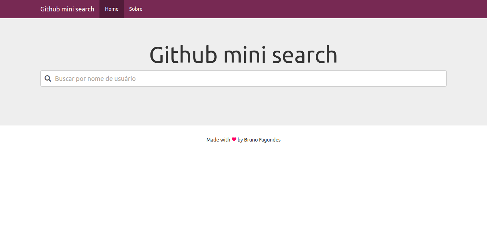

# Github mini search

Esse é um exercício de avaliação técnica feito com angularJS para consumir a API do github.



## Requirements

```
npm
bower
```

## Setup

```
npm install
bower install
```

## Running

```
npm start
http://localhost:8080/
```
